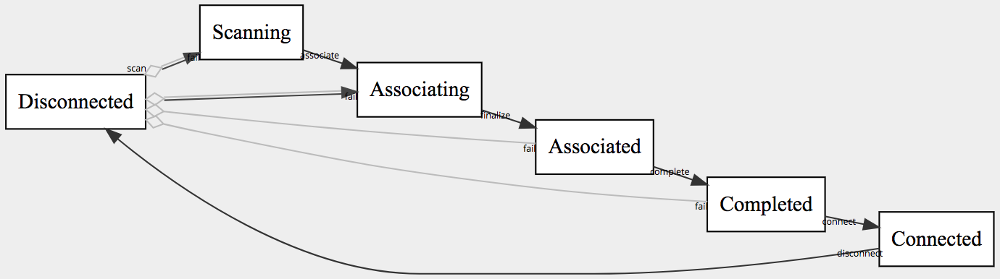
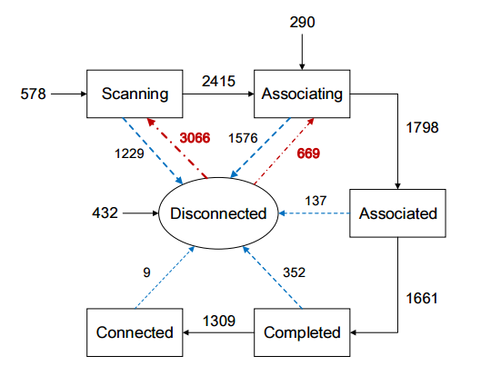

# fsl_wifi_lifecycle
FSL implementation of the wifi lifecycle

## Render


## Impl
```fsl
machine_name     : "Wifi lifecycle";
machine_author   : "John Haugeland <stonecypher@gmail.com>";
machine_license  : MIT;
machine_language : en;
machine_version  : 1.0.1;
fsl_version      : 1.0.0;

start_states     : [Disconnected];


Disconnected 'scan'       =>
Scanning     'associate'  =>
Associating  'finalize'   =>
Associated   'complete'   =>
Completed    'connect'    =>
Connected    'disconnect' => Disconnected;

Disconnected => Associating;

[Scanning Associating Associated Completed] 'fail' ~> Disconnected;
```

## Reference
From [Data Mining Solves the Mystery of Your Slow Wi-fi Connection](https://www.technologyreview.com/s/603414/data-mining-solves-the-mystery-of-your-slow-wi-fi-connection/):

